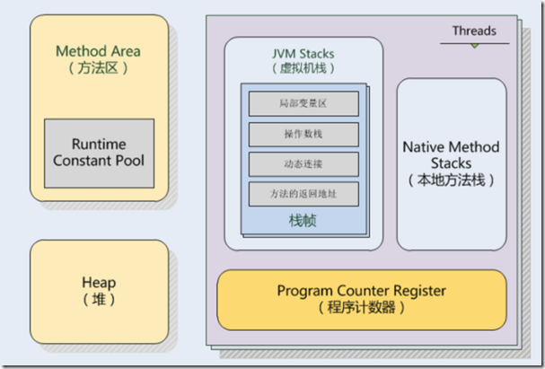
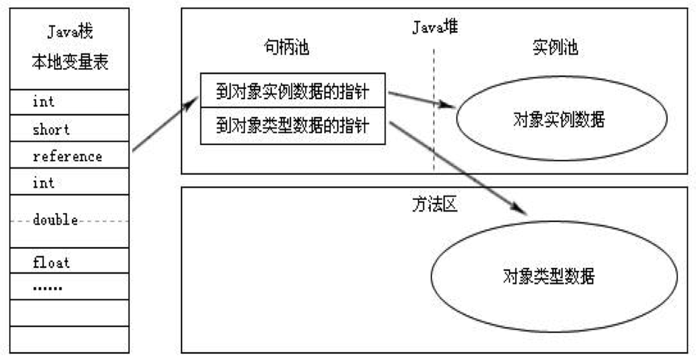
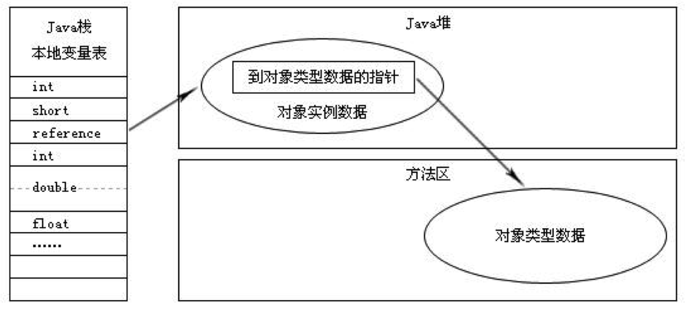

# Java内存区域

### 1. 运行时数据区
JVM虚拟机管理的内存会在执行时被划分为以下几个区域,总体的内存模型如下：

其中方法区和Java堆是所有线程共享的，而JVM栈、本地方法栈、程序计数器是线程私有的。

* 程序计数器
 	* 一块较小的内存, 可以看成是当前线程所执行的字节码的行号指示器，目的是为了引导字节码解析的顺序（字节码解释器通过改变这个计数器的值来选取下一条要执行的字节码指令）
 	* 如果线程执行一个Java方法，则程序计数器存放虚拟机字节码指令的地址，如果执行一个Native放法，则为空
 	* 唯一一个没有规定任何OutOfMemoryError情况的区域
 	
* JVM栈
	* Java方法执行时的内存模型,每一个方法执行的同时会创建一个栈帧（Stack Frame），用于存放局部变量表，操作数栈，动态链接，放法出口等信息。每一个方法的执行对应着栈帧在JVM栈中的入栈、出栈过程。
		* 局部变量表:存放编译期可知的各种基本类型、对象引用类型和returnAddress类型（指向一条字节码指令的地址，即函数返回地址）。局部变量表所需内存在编译期确定，进入一个方法时，方法在栈帧中所分配的局部变量是完全确定的，不可动态改变大小。32位数据占用一个slot, 64位数据占用两个slot（long，double）,引用类型可能占一个也可能占两个。
		* 操作数栈：最大深度由编译期确定。用于存放JVM从局部变量表复制的常量或者变量，提供提取，及结果入栈，也用于存放调用方法需要的参数及接受方法返回的结果。
		* 动态链接：每个栈帧都包含一个指向运行时常量池中该栈帧所属方法的引用，持有这个引用是为了支持方法调用过程中的动态连接。
		* 方法返回地址：当执行引擎遇到任意一个方法返回的字节码指令或者未在方法内处理的异常时会退出该方法。退出时需要返回到方法被调用的位置。方法返回时可能需要在栈帧中保存一些信息，用来帮助恢复它的上层方法的执行状态。（一般来说，方法正常退出时，调用者的PC计数器的值就可以作为返回地址，栈帧中很可能保存了这个计数器值; 方法异常退出时，返回地址是要通过异常处理器来确定的，栈帧中一般不会保存这部分信息）方法退出的过程实际上等同于把当前栈帧出栈，因此退出时可能执行的操作有：恢复上层方法的局部变量表和操作数栈，如果有返回值，则把它压入调用者栈帧的操作数栈中，调整PC计数器的值以指向方法调用指令后面的一条指令。
		
	* 规定了两种异常状况，如果线程请求的栈深度大于虚拟机所允许的深度，将抛出StackOverflowError异常; 如果虚拟机扩展时无法申请到足够的内存，将抛出OutOfMemoryError异常。 
	
* 本地方法栈
	* 作用与JVM栈类似，区别时本地方法栈为虚拟机使用到的native方法服务。
	* 有的虚拟机会把本地方法栈和JVM栈合二为一。
	
* 堆
	* 虚拟机启动时创建，用于存放对象实例和数组，是垃圾收集器管理的主要区域。
	* 可以处于物理上不连续的内存空间中，只要逻辑上连续即可。
	* 若在堆中没有完成实例分配，并且堆也无法再扩展时，将会抛出OutOfMemoryError异常。
	
* 方法区
	* 于存储被虚拟机加载的类信息、常量、静态变量、即时编译器编译后的代码等。
	* 与堆一样逻辑上连续即可，还可以选择不实现垃圾收集，若要回收则主要针对常量池和对类型的卸载。
	* 当方法区无法满足内存分配需求时，将抛出OutOfMemoryError异常。 

* 运行时常量池
	* 方法区的一部分。用于存放编译期生成的各种字面量和符号引用，这部分内容将在类加载后进入方法区的运行时常量池中存放。
	* Java语言并不要求常量一定只有编译期才能产生，也可能在运行时将新的常量放入池中，这种特性被开发人员利用得比较多是便是String类的intern方法。
	* 当常量池无法再申请到内存时会抛出OutOfMemoryError异常。
	
### 2. Hotspot虚拟机对象
* 对象的创建
	* 当遇到一条new指令时，检查这个指令的参数能否在常量池中定位到一个类的符号引用，并且检测这个符号引用代表的类是否已经加载、解析和初始化。如果没有则先执行相应的类加载过程。
	* 然后分配内存。内存大小在类加载完成后便可确定。因此分配空间的任务等同于把一块内存从Java堆中划分出来。这里有两种策略，使用哪种分配方式由Java堆是否规整决定，而是否规整由垃圾收集器算法决定。
		*  指针碰撞：假设Java堆中的内存绝对规整，即所有用过的内存放在一边，空闲的内存在另一边，中间是一个作为分界点的指示器，那分配内存等同于把指针向空闲边挪动一段与对象大小相等的距离。
		* 空闲列表：假设Java堆中的内存不规整，已使用的内存和未分配的内存相互交织，那就需要维护一个列表去记录哪些内存块可用，分配的时候找一个足够大的空间划分给对象实例，并更新列表上的记录。
	* 虚拟机需要对对象进行必要的设置，例如这个对象是哪个类的实例、如何找到类的元数据信息等。这些信息存放在对象头中。
	* 执行 < init > 方法，把对象按照程序员的意愿进行初始化。
	
* 对象的内存布局
	主要有3块区域：对象头、实例数据和对齐填充。
	* 对象头：包含两部分。一是记录对象自身的运行时数据如哈希码、GC分代年龄、锁状态标志、线程持有的锁等。另一部分是类型指针，即指向它的类元数据的指针（注意不是所有虚拟机都必须在这里保留类型指针）。
	* 实例数据：存储代码中定义的各种类型的字段。
	* 对齐填充：要求对象起始位置是8字节的整数倍，也就是对象大小是8字节的整数倍。当对象实例数据部分没有对齐时则需要填充补全。
	
* 对象的访问定位
为了使用对象，Java程序需要通过栈上的reference数据操作堆上的具体对象。这里的访问方式主要有两种：
	* 句柄访问：Java堆划分一块内存作为句柄池，reference存储句柄地址，句柄中包含对象实例数据和类型数据的地址，如下图
	
	* 直接指针访问：reference存储的直接就是对象地址，如下
	